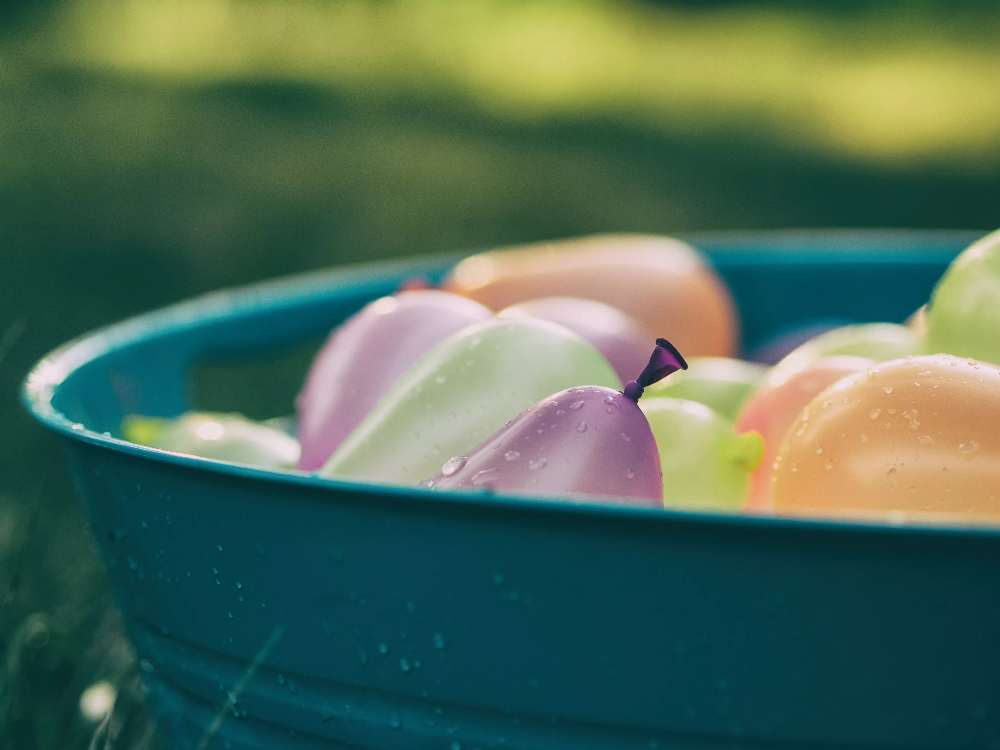
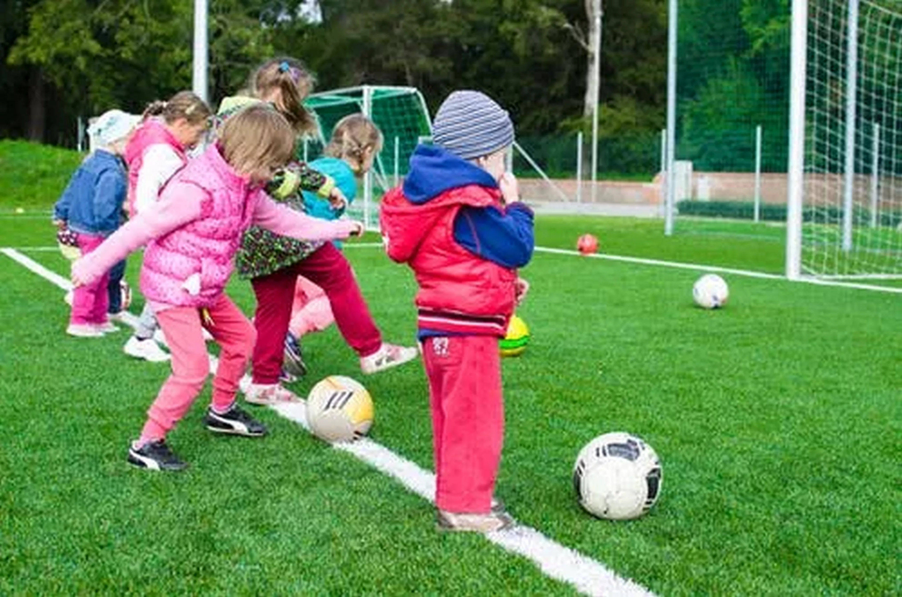
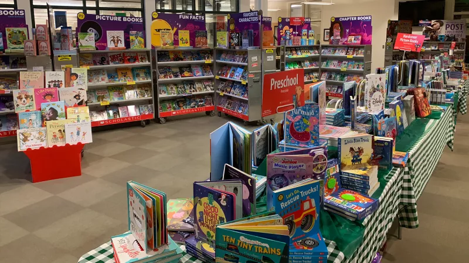
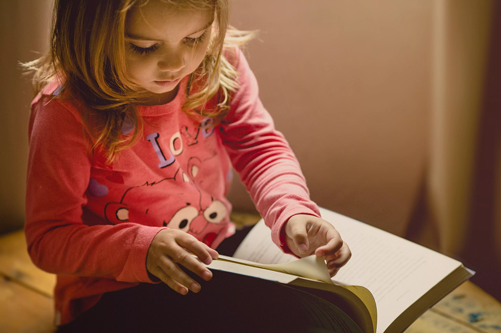

We are wrapping up the school year with some great events! First, on June 15th we will have a school wide field day. There will be fun activities for the children to complete that day. Have your child bring an extra outfit for the water balloon toss and you are bound to get wet.

During our last week of school we will be hosting a book fair. Items will range from $1-$20. Your child's teacher will send home a schedule with a specific day for in-school purchases. If you want to volunteer, contact our office.

## Event List

1. Field Day, June 15th
2. Book Fair, June 29th and 30th
